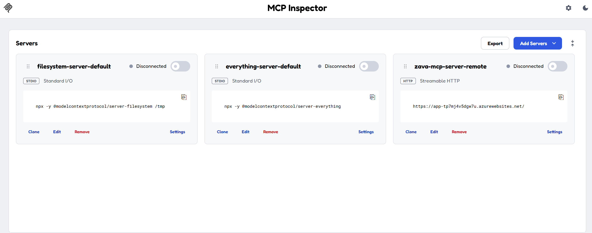
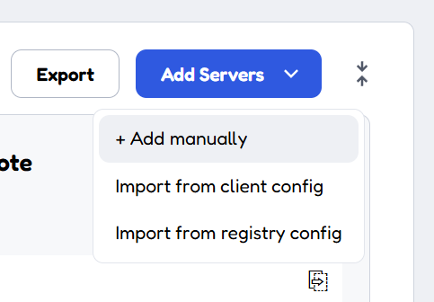
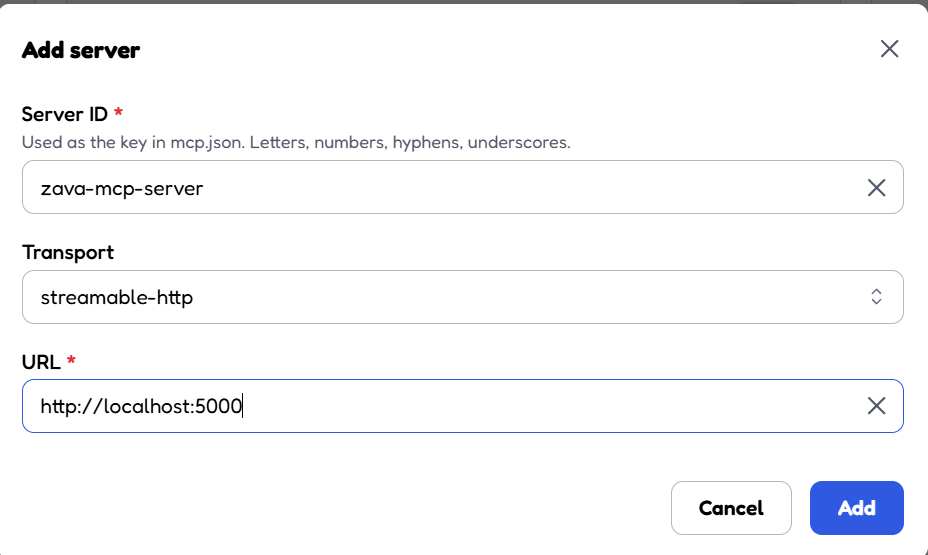
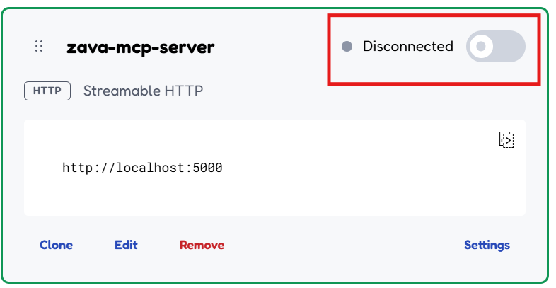
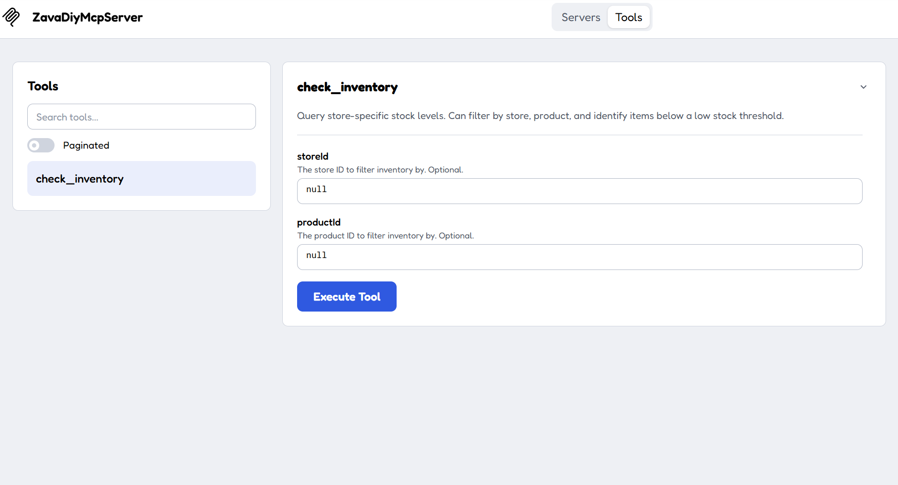
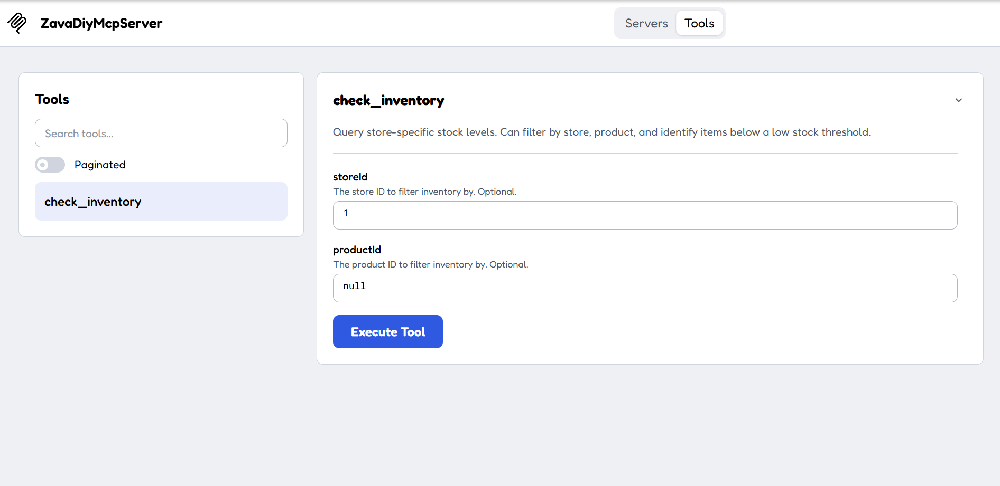
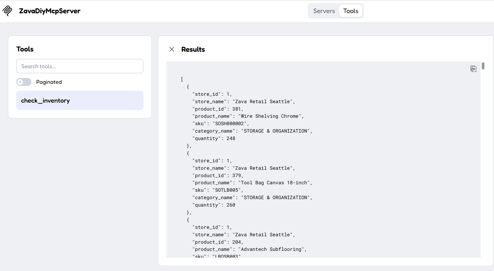

# Building the ZavaDiyMcpServer

Step-by-step instructions to create an MCP (Model Context Protocol) server in .NET that exposes retail database tools for AI agents.

---

## Prerequisites

- [.NET 10 SDK](https://dotnet.microsoft.com/download) (or later)
- Access to a PostgreSQL database with the Zava DIY retail schema
- A code editor (VS Code recommended)

---

## Step 1: Create the Project

Open a terminal and run:

```bash
dotnet new web -n ZavaDiyMcpServer
cd ZavaDiyMcpServer
```

This creates a minimal ASP.NET Core project.

## Step 2: Add NuGet Packages

```bash
dotnet add package ModelContextProtocol.AspNetCore --version 2.0.0
dotnet add package Npgsql --version 9.0.3
```

- **ModelContextProtocol.AspNetCore** — Provides the MCP server framework with HTTP transport.
- **Npgsql** — PostgreSQL ADO.NET data provider.

## Step 3: Configure the Connection String

Replace the contents of `appsettings.json` with:

```json
{
  "ConnectionStrings": {
    "PostgreSQL": "Host=<your-host>;Database=zava;Username=<user>;Password=<password>;SSL Mode=Require;Trust Server Certificate=true"
  },
  "Logging": {
    "LogLevel": {
      "Default": "Information",
      "Microsoft.AspNetCore": "Warning"
    }
  }
}
```

Replace the placeholders with your actual database connection details.

## Step 4: Configure the Launch Profile

Replace the contents of `Properties/launchSettings.json` with:

```json
{
  "profiles": {
    "http": {
      "commandName": "Project",
      "dotnetRunMessages": true,
      "launchBrowser": false,
      "applicationUrl": "http://localhost:5000",
      "environmentVariables": {
        "ASPNETCORE_ENVIRONMENT": "Development"
      }
    }
  }
}
```

## Step 5: Create the Database Service

Create a file named `DatabaseService.cs`:

```csharp
using System.Data.Common;
using Npgsql;

namespace ZavaDiyMcpServer;

public interface IDatabaseService
{
    DbConnection CreateConnection();
}

public class DatabaseService : IDatabaseService
{
    private readonly string _connectionString;

    public DatabaseService(IConfiguration configuration)
    {
        _connectionString = configuration.GetConnectionString("PostgreSQL")
            ?? throw new InvalidOperationException("PostgreSQL connection string is not configured.");
    }

    public DbConnection CreateConnection() => new NpgsqlConnection(_connectionString);
}
```

This provides a simple abstraction over database connections that can be injected into the tool classes.

## Step 6: Create the Inventory Tool

Create a file named `InventoryTools.cs`:

```csharp
using System.ComponentModel;
using System.Data.Common;
using System.Text;
using System.Text.Json;
using ModelContextProtocol.Server;

namespace ZavaDiyMcpServer;

[McpServerToolType]
public class InventoryTools
{
    private readonly IDatabaseService _db;

    public InventoryTools(IDatabaseService db)
    {
        _db = db;
    }

    [McpServerTool, Description("Query store-specific stock levels. Can filter by store, product, and identify items below a low stock threshold.")]
    public async Task<string> CheckInventory(
        [Description("The store ID to filter inventory by. Optional.")] int? storeId = null,
        [Description("The product ID to filter inventory by. Optional.")] int? productId = null)
    {
        await using var connection = _db.CreateConnection();
        await connection.OpenAsync();

        var sql = new StringBuilder("""
            SELECT
                i.store_id,
                s.store_name,
                i.product_id,
                p.product_name AS product_name,
                p.sku,
                c.category_name,
                i.stock_level
            FROM retail.inventory i
            JOIN retail.products p ON p.product_id = i.product_id
            JOIN retail.stores s ON s.store_id = i.store_id
            JOIN retail.product_types pt ON pt.type_id = p.type_id
            JOIN retail.categories c ON c.category_id = pt.category_id
            WHERE 1=1
            """);

        var parameters = new List<DbParameter>();

        if (storeId.HasValue)
        {
            sql.Append(" AND i.store_id = @storeId");
            var p = connection.CreateCommand().CreateParameter();
            p.ParameterName = "@storeId";
            p.Value = storeId.Value;
            parameters.Add(p);
        }

        if (productId.HasValue)
        {
            sql.Append(" AND i.product_id = @productId");
            var p = connection.CreateCommand().CreateParameter();
            p.ParameterName = "@productId";
            p.Value = productId.Value;
            parameters.Add(p);
        }

        sql.Append(" ORDER BY i.stock_level ASC");

        await using var cmd = connection.CreateCommand();
        cmd.CommandText = sql.ToString();
        foreach (var p in parameters) cmd.Parameters.Add(p);

        await using var reader = await cmd.ExecuteReaderAsync();

        var results = new List<Dictionary<string, object?>>();
        while (await reader.ReadAsync())
        {
            results.Add(new Dictionary<string, object?>
            {
                ["store_id"] = reader.GetInt32(0),
                ["store_name"] = reader.GetString(1),
                ["product_id"] = reader.GetInt32(2),
                ["product_name"] = reader.GetString(3),
                ["sku"] = reader.GetString(4),
                ["category_name"] = reader.GetString(5),
                ["quantity"] = reader.GetInt32(6)
            });
        }

        return JsonSerializer.Serialize(results, new JsonSerializerOptions { WriteIndented = true });
    }
}
```

### Key Concepts for Tools

- **`[McpServerToolType]`** — Marks the class as containing MCP tools.
- **`[McpServerTool]`** — Marks a method as an MCP tool that AI agents can call.
- **`[Description("...")]`** — Provides a description for the tool or its parameters. The AI agent uses these to understand when and how to call the tool.
- Parameters with default values (e.g., `int? storeId = null`) become optional inputs for the agent.
- Tools return serialized JSON strings that the agent can interpret.

## Step 7: Wire the inventory tool and database service in Program.cs

Replace the contents of `Program.cs` with:

```csharp
using ZavaDiyMcpServer;

var builder = WebApplication.CreateBuilder(args);

builder.Services.AddMcpServer()
    .WithHttpTransport()
    .WithTools<InventoryTools>();

builder.Services.AddSingleton<IDatabaseService, DatabaseService>();

var app = builder.Build();

app.MapMcp();

app.Run();
```

### What this does:

1. **`AddMcpServer()`** — Registers the MCP server services.
2. **`WithHttpTransport()`** — Configures HTTP as the transport layer (uses SSE for streaming).
3. **`WithTools<T>()`** — Registers each tool class so its methods are exposed as MCP tools.
4. **`AddSingleton<IDatabaseService, DatabaseService>()`** — Registers the database service for dependency injection into tool constructors.
5. **`MapMcp()`** — Maps the MCP endpoint routes on the web application.

## Step 8: Build and Run

```bash
dotnet build
dotnet run
```

The server will start on `http://localhost:5000`. The MCP endpoint is available at `http://localhost:5000/mcp`.

## Step 9: Confirm that the MCP server is running

#### With Visual Studio Code (requires Github copilot subscription):

1. Press CTRL + Shift + P to open the command palette.
2. Select `HTTP` as the transport method.
3. Enter the URL for the server (`http://localhost:5000/mcp`) and hit "Enter".
4. Open a Github Copilot chat windown and ask it to list the available tools. You should see `CheckInventory` listed.

#### With MCP Inspector:

1. Open a command terminal and type the following command: npx @modelcontextprotocol/inspector
2. You will be asked if you want to install the MCP inspector packages, type `y` and hit "Enter".
3. Once the inspector is running, the UI will open automatically:



4. Click on the "Add Server" button and select "Add manually":



5. Fill out the screen with the following information:



6. To connect to the server, click on the "Disconnected" toggle:



7. Click on "Tools":



8. Select the "check_inventory" tool:



9. Set the value of storeId to 1 and click "Execute Tool", the server should return the store inventory:



## Step 10: Create the Order Tool

Create a file named `OrderTools.cs`:

```csharp
using System.ComponentModel;
using System.Data.Common;
using System.Text;
using System.Text.Json;
using ModelContextProtocol.Server;

namespace ZavaDiyMcpServer;

[McpServerToolType]
public class OrderTools
{
    private readonly IDatabaseService _db;

    public OrderTools(IDatabaseService db)
    {
        _db = db;
    }

    [McpServerTool, Description("Retrieve orders with optional filters by customer, store, or date range. Returns order details including items, products, and totals.")]
    public async Task<string> GetOrders(
        [Description("Customer ID to filter orders by. Optional.")] int? customerId = null,
        [Description("Store ID to filter orders by. Optional.")] int? storeId = null,
        [Description("Start date for the date range filter (inclusive), in yyyy-MM-dd format. Optional.")] string? startDate = null,
        [Description("End date for the date range filter (inclusive), in yyyy-MM-dd format. Optional.")] string? endDate = null,
        [Description("Maximum number of orders to return. Defaults to 50.")] int limit = 50)
    {
        await using var connection = _db.CreateConnection();
        await connection.OpenAsync();

        var sql = new StringBuilder("""
            SELECT
                o.order_id,
                o.customer_id,
                cu.first_name || ' ' || cu.last_name AS customer_name,
                o.store_id,
                s.store_name,
                o.order_date,
                oi.product_id,
                p.product_name,
                p.sku,
                oi.quantity,
                oi.unit_price,
                oi.discount_percent,
                oi.total_amount AS line_total
            FROM retail.orders o
            JOIN retail.order_items oi ON oi.order_id = o.order_id
            JOIN retail.products p ON p.product_id = oi.product_id
            JOIN retail.stores s ON s.store_id = o.store_id
            JOIN retail.customers cu ON cu.customer_id = o.customer_id
            WHERE 1=1
            """);

        DbParameter CreateParam(string name, object value)
        {
            var p = connection.CreateCommand().CreateParameter();
            p.ParameterName = name;
            p.Value = value;
            return p;
        }

        var parameters = new List<DbParameter>();

        if (customerId.HasValue)
        {
            sql.Append(" AND o.customer_id = @customerId");
            parameters.Add(CreateParam("@customerId", customerId.Value));
        }

        if (storeId.HasValue)
        {
            sql.Append(" AND o.store_id = @storeId");
            parameters.Add(CreateParam("@storeId", storeId.Value));
        }

        if (startDate is not null)
        {
            sql.Append(" AND o.order_date >= @startDate");
            parameters.Add(CreateParam("@startDate", DateOnly.Parse(startDate)));
        }

        if (endDate is not null)
        {
            sql.Append(" AND o.order_date <= @endDate");
            parameters.Add(CreateParam("@endDate", DateOnly.Parse(endDate)));
        }

        sql.Append(" ORDER BY o.order_date DESC, o.order_id, oi.product_id");
        sql.Append(" LIMIT @limit");
        parameters.Add(CreateParam("@limit", limit));

        await using var cmd = connection.CreateCommand();
        cmd.CommandText = sql.ToString();
        foreach (var p in parameters) cmd.Parameters.Add(p);

        await using var reader = await cmd.ExecuteReaderAsync();

        var results = new List<Dictionary<string, object?>>();
        while (await reader.ReadAsync())
        {
            results.Add(new Dictionary<string, object?>
            {
                ["order_id"] = reader.GetInt32(0),
                ["customer_id"] = reader.GetInt32(1),
                ["customer_name"] = reader.GetString(2),
                ["store_id"] = reader.GetInt32(3),
                ["store_name"] = reader.GetString(4),
                ["order_date"] = reader.GetFieldValue<DateOnly>(5).ToString("yyyy-MM-dd"),
                ["product_id"] = reader.GetInt32(6),
                ["product_name"] = reader.GetString(7),
                ["sku"] = reader.GetString(8),
                ["quantity"] = reader.GetInt32(9),
                ["unit_price"] = reader.GetDecimal(10),
                ["discount_percent"] = reader.GetDecimal(11),
                ["line_total"] = reader.GetDecimal(12)
            });
        }

        return JsonSerializer.Serialize(results, new JsonSerializerOptions { WriteIndented = true });
    }
}
```

## Step 11: Create the Product Tools

Create a file named `ProductTools.cs`:

```csharp
using System.ComponentModel;
using System.Data.Common;
using System.Text;
using System.Text.Json;
using ModelContextProtocol.Server;

namespace ZavaDiyMcpServer;

[McpServerToolType]
public class ProductTools
{
    private readonly IDatabaseService _db;

    public ProductTools(IDatabaseService db)
    {
        _db = db;
    }

    [McpServerTool, Description("Look up product details including pricing, category, and description. Can filter by product ID, SKU, or category.")]
    public async Task<string> GetProductInfo(
        [Description("Product ID to look up. Optional.")] int? productId = null,
        [Description("Product SKU to look up. Optional.")] string? sku = null,
        [Description("Category name to filter products by. Optional.")] string? category = null,
        [Description("Maximum number of products to return. Defaults to 50.")] int limit = 50)
    {
        await using var connection = _db.CreateConnection();
        await connection.OpenAsync();

        var sql = new StringBuilder("""
            SELECT
                p.product_id,
                p.product_name,
                p.sku,
                p.product_description,
                p.cost AS cost_price,
                p.base_price AS retail_price,
                pt.type_name,
                c.category_name
            FROM retail.products p
            JOIN retail.product_types pt ON pt.type_id = p.type_id
            JOIN retail.categories c ON c.category_id = pt.category_id
            WHERE 1=1
            """);

        DbParameter CreateParam(string name, object value)
        {
            var p = connection.CreateCommand().CreateParameter();
            p.ParameterName = name;
            p.Value = value;
            return p;
        }

        var parameters = new List<DbParameter>();

        if (productId.HasValue)
        {
            sql.Append(" AND p.product_id = @productId");
            parameters.Add(CreateParam("@productId", productId.Value));
        }

        if (sku is not null)
        {
            sql.Append(" AND p.sku = @sku");
            parameters.Add(CreateParam("@sku", sku));
        }

        if (category is not null)
        {
            sql.Append(" AND c.category_name ILIKE @category");
            parameters.Add(CreateParam("@category", category));
        }

        sql.Append(" ORDER BY c.category_name, pt.type_name, p.product_name");
        sql.Append(" LIMIT @limit");
        parameters.Add(CreateParam("@limit", limit));

        await using var cmd = connection.CreateCommand();
        cmd.CommandText = sql.ToString();
        foreach (var p in parameters) cmd.Parameters.Add(p);

        await using var reader = await cmd.ExecuteReaderAsync();

        var results = new List<Dictionary<string, object?>>();
        while (await reader.ReadAsync())
        {
            results.Add(new Dictionary<string, object?>
            {
                ["product_id"] = reader.GetInt32(0),
                ["product_name"] = reader.GetString(1),
                ["sku"] = reader.GetString(2),
                ["description"] = reader.GetString(3),
                ["cost_price"] = reader.GetDecimal(4),
                ["retail_price"] = reader.GetDecimal(5),
                ["product_type"] = reader.GetString(6),
                ["category"] = reader.GetString(7)
            });
        }

        return JsonSerializer.Serialize(results, new JsonSerializerOptions { WriteIndented = true });
    }

    [McpServerTool, Description("Search products by text query against product names and descriptions. Returns matching products ranked by relevance.")]
    public async Task<string> SearchProducts(
        [Description("The search text to match against product names and descriptions.")] string queryText,
        [Description("Maximum number of results to return. Defaults to 10.")] int topK = 10)
    {
        await using var connection = _db.CreateConnection();
        await connection.OpenAsync();

        var sql = """
            SELECT
                p.product_id,
                p.product_name,
                p.sku,
                p.product_description,
                p.cost AS cost_price,
                p.base_price AS retail_price,
                pt.type_name,
                c.category_name
            FROM retail.products p
            JOIN retail.product_types pt ON pt.type_id = p.type_id
            JOIN retail.categories c ON c.category_id = pt.category_id
            WHERE p.product_name ILIKE @pattern OR p.product_description ILIKE @pattern
            ORDER BY
                CASE WHEN p.product_name ILIKE @pattern THEN 0 ELSE 1 END,
                p.product_name
            LIMIT @topK
            """;

        var pattern = $"%{queryText}%";

        await using var cmd = connection.CreateCommand();
        cmd.CommandText = sql;
        var pPattern = cmd.CreateParameter();
        pPattern.ParameterName = "@pattern";
        pPattern.Value = pattern;
        cmd.Parameters.Add(pPattern);
        var pTopK = cmd.CreateParameter();
        pTopK.ParameterName = "@topK";
        pTopK.Value = topK;
        cmd.Parameters.Add(pTopK);

        await using var reader = await cmd.ExecuteReaderAsync();

        var results = new List<Dictionary<string, object?>>();
        while (await reader.ReadAsync())
        {
            results.Add(new Dictionary<string, object?>
            {
                ["product_id"] = reader.GetInt32(0),
                ["product_name"] = reader.GetString(1),
                ["sku"] = reader.GetString(2),
                ["description"] = reader.GetString(3),
                ["cost_price"] = reader.GetDecimal(4),
                ["retail_price"] = reader.GetDecimal(5),
                ["product_type"] = reader.GetString(6),
                ["category"] = reader.GetString(7)
            });
        }

        return JsonSerializer.Serialize(results, new JsonSerializerOptions { WriteIndented = true });
    }
}
```

---

## Summary of Tools Created

| Tool | File | Description |
|------|------|-------------|
| `CheckInventory` | `InventoryTools.cs` | Query stock levels by store and/or product |
| `GetOrders` | `OrderTools.cs` | Retrieve orders with filters for customer, store, and date range |
| `GetProductInfo` | `ProductTools.cs` | Look up product details by ID, SKU, or category |
| `SearchProducts` | `ProductTools.cs` | Text search across product names and descriptions |

---

## Step 12: Deploy to Azure

Once you have verified that the MCP server is running locally, you can deploy it to Azure using the Azure Developer CLI (azd). For detailed instructions, see the [Deploying to Azure](DeployMcpServer.md) section.

---

## Tool Authoring Pattern

To add a new tool:

1. Create a class decorated with `[McpServerToolType]`.
2. Inject `IDatabaseService` via the constructor.
3. Add a public async method decorated with `[McpServerTool]` and a `[Description]` attribute.
4. Decorate each parameter with `[Description]` so the AI agent knows what to pass.
5. Register the class in `Program.cs` with `.WithTools<YourToolClass>()`.
